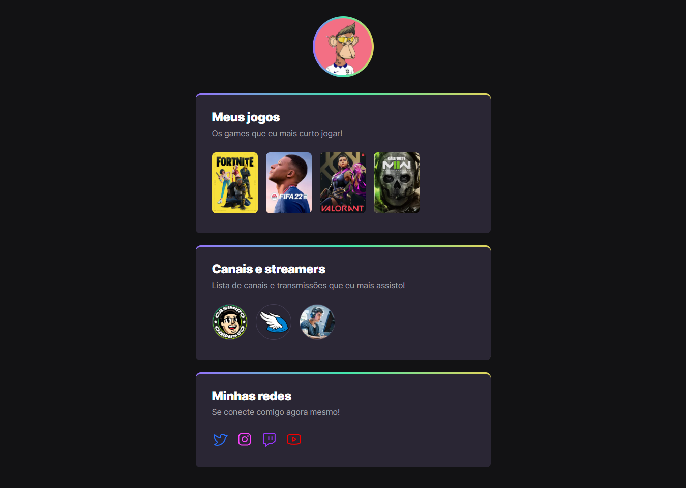

# NLW eSports - Trilha Explorer

Projeto construído do evento Next Level Week da Rocketseat.

[🔗 Clique aqui para acessar] (https://caioguimaraes18.github.io/nlw-esports-explorer/)

## 🚀 Tecnologias

- HTML
- CSS
-Git e Github

## O que eu apredendi 

Essa foi minha primeira NLW, onde eu aprendi bastante coisa sobre HTML e também CSS. Achei muito legal as animações que conseguimos fazer atráves do CSS, que deixa o site muito interativo.

## ☎️ Contato

contatocaioguimaraess@gmail.com